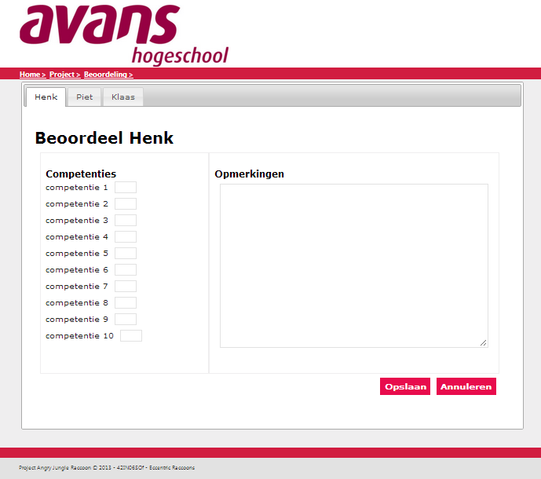

#Prototypes
##Leraar deel
Groepen toewijzen aan projecten

|Nummer|Requirement|
|:---|:---|
|12.1.1|Systeem geeft de optie om groepen toe te wijzen aan project|
|12.1.2|Systeem toont lijst met mogelijke projecten|
|12.1.3|Indien project-docent maar een project heeft: Systeem gaat verder naar groepen selecteren|
|12.2.1|Systeem laat project-docent een project selecteren|
|12.3.1|Systeem laat een lijst met mogelijke groepen zien|
|12.3.2|Systeem laat zien welke studenten in de groepen zitten|
|12.4.1|Systeem laat project-docent groep(en) selecteren|
|12.4.2|Systeem laat project-docent projectgroepen opslaan|
|12.4.3|Systeem stuurt de projectgroepen door naar de database|
|12.5.1|Systeem laat het zien als projectgroepen maken niet gelukt is|
|12.5.2|Systeem laat het zien als projectgroepen maken geslaagd is|
|12.1.4|Het systeem kan een lijst met projecten tonen.|
|12.1.5|Het systeem zal de gebruiker direct doorverwijzen naar een project wanneer de gebruiker maar één project heeft.|
|12.1.6|Gebruikers hebben projecten.|
|12.2.2|De gebruiker kan een project selecteren uit een lijst met projecten.|
|12.3.3|Het systeem kan van een project een lijst met groepen die deelnemen aan het project, en studenten die lid zijn van deze groepen weergeven.|
|12.4.4|Projecten kunnen verborgen zijn voor de deelnemende leden.|
|12.4.5|De gebruiker kan projecten zichtbaar maken voor de deelnemers.|

Groepsindeling aanmaken

|Nummer|Requirement|
|:---|:---|
|2.1.1|Systeem geeft de optie om groepen aan te maken.|
|2.2.1|Systeem laat blokcoördinator naam voor de groepen invullen.|
|2.3.1|Systeem leest bestand met groepen in.|
|2.3.2|Systeem laat de groepen zien.|
|2.5.1|Systeem laat blokcoördinator groepen opslaan.|
|2.6.1|Systeem geeft mogelijkheid tussen doorgaan of stoppen.|
|2.6.2|Indien keuze doorgaan: Systeem stuurt groepen naar database.|
|2.6.3|Indien keuze stoppen: Systeem gaat terug naar groepnamen invullen.|
|2.7.1|Systeem laat het zien als groepsindeling maken geslaagd is.|
|2.7.2|Systeem laat het zien als groepsindeling maken niet gelukt is.|
|2.1.2|De gebruiker kan nieuwe projectgroepen binnen het systeem aanmaken.|
|2.2.2|Een projectgroep heeft een naam.|
|2.2.3|De gebruiker kan een projectgroep in the systeem een naam geven.|
|2.3.3|Het systeem kan bestanden met groepsinformatie inlezen en verwerken.|
|2.4.1|De gebruiker kan leden toevoegen aan projectgroepen.|
|2.5.2|Het systeem kan de nieuw aangemaakte projectgroep opslaan.|
|2.6.4|Het systeem kan de gebruiker doorverwijzen naar het aanmaken van een nieuwe groep nadat een groep is aangemaakt.|

Klacht indienen

Mentor vooruitgang student inzien

|Nummer|Requirement|
|:---|:---|
|13.1.1|Systeem geeft de optie om de vooruitgang van een student te volgen.|
|13.2.1|Systeem controleert welke studenten mentorstudenten zijn van de mentor.|
|13.2.2|Systeem toont een lijst met studenten.|
|13.3.1|Systeem laat de mentor een student selecteren.|
|13.4.1|Systeem toont een overzicht met de vooruitgang van een student.|
|13.4.2|Systeem kan een of meerdere projecten weergeven.|
|13.5.1|Systeem geeft mogelijkheid tot exporteren.|
|13.1.2|Het systeem kan de beoordelingen binnen een project exporteren naar een Excel bestand.|
|13.2.3|Het systeem kan aan de gebruiker een lijst van studenten weergeven.|
|13.4.3|Het systeem kan een overzicht van de beoordelingsgeschiedenis van een student laten zien.|

Onderbouwing aanvragen

|Nummer|Requirement|
|:---|:---|
|10.1.1|Systeem geeft de optie om een project beoordeling te exporteren.|
|10.2.1|Systeem toont het gekozen project.|
|10.3.1|Systeem laat project-docent de beoordelingen exporteren naar een excel bestand.|
|10.4.1|Systeem exporteert de beoordelingen naar excel.|

Opmerkingen scherm

Project aanmaken (nieuw project)

|Nummer|Requirement|
|:---|:---|
|8.1.2|Systeem laat project-docent projectnaam toevoegen.|
|8.1.3|Systeem laat project-docent projectomschrijving toevoegen.|
|8.1.4|Systeem laat project-docent competenties toevoegen.|
|8.1.5|Systeem creeërt het project zodra projectdocent het project bevestigd.|
|8.1.6|Systeem stuurt het project naar de database.|

Project aanmaken (gebaseerd op voorgaand project)

|Nummer|Requirements|
|:---|:---|
|8.2.1|Systeem geeft een scherm weer met voorgaande projecten.|
|8.2.2|Systeem laat project-docent een project selecteren.|
|8.2.3|Systeem laadt het project in.|
|8.2.4|Systeem geeft scherm weer met ingeladen project.|
|8.2.5|Systeem laat project-docent wijzingen toebrengen aan projectnaam.|
|8.2.6|Systeem laat project-docent wijzingen toebrengen aan projectomschrijving.|
|8.2.7|Systeem laat project-docent wijzingen toebrengen aan competenties.|

Student cijfer toekennen

|Nummer|Requirements|
|:---|:---|
|6.1.1|Systeem geeft de optie om beoordelingsadviezen te zien.|
|6.1.2|Systeem controleert van welke projecten de docent tutor is.|
|6.1.3|Systeem laat een lijst met projecten zien.|
|6.1.4|Systeem laat tutor een project selecteren.|
|6.2.1|Systeem laat een lijst met projectgroepen zien.|
|6.2.2|Systeem laat tutor een groep selecteren.|
|6.3.1|Systeem laat geeft studenten in de groep weer.|
|6.3.2|Systeem laat tutor een student selecteren.|
|6.4.1|Systeem geeft de beoordelingsadviezen weer.|

Student non-actief zetten

|Nummer|Requirements|
|:---|:---|
|7.1.1|Systeem geeft de optie om een student op non actief te zetten.|
|7.2.1|Systeem toont een veld met student namen.|
|7.2.2|Systeem geeft hier automatisch autosuggesties bij.|
|7.3.1|Systeem laat mentor zoeken op studentnummer.|
|7.3.2|Systeem laat mentor zoeken op naam.|
|7.4.1|Systeem laat mentor een student selecteren.|
|7.5.1|Systeem geeft de optie om geselecteerde student op non actief te zetten.|
|7.6.1|Systeem vraagt om extra bevestiging bij non-actief zetten van student.|
|7.6.2|Indien afgewezen: Systeem maakt selectie ongedaan.|
|7.6.3|Indien bevestigd: Systeem zet student op non actief.|
|7.7.1|Non-actieve student kan niet deelnemen aan projecten.|
|7.7.2|Non-actieve student wordt niet uit het systeem verwijderd.|
|7.7.3|Non-actieve student blijft wel inzichtelijk.|
|7.1.2|Een student kan op non-actief staan in het systeem.|
|7.1.3|De gebruiker kan studenten op non-actief stellen.|
|7.2.3|Het systeem kan studenten zoeken gebaseerd op naam of studentnummer.|
|7.5.2|De gebruiker kan een gevonden student selecteren.|
|7.6.4|Het systeem kan de gebruiker om een bevestiging vragen bij het op non-actief stellen van den student.|

Tutor toewijzing

|Nummer|Requirement|
|:---|:---|
|11.1.1|Systeem toont een optie om tutoren toe te wijzen.|
|11.1.2|Systeem toont een lijst met project waaraan tutoren toegewezen kunnen worden.|
|11.2.1|Systeem laat inzetter een project selecteren.|
|11.3.1|Systeem toont een overzicht met alle groepen uit het project.|
|11.3.2|Systeem controleert welke docenten beschikbaar zijn.|
|11.3.3|Systeem toont per groep een autosuggestie met beschikbare docenten.|
|11.4.1|Systeem laat inzetter docenten toewijzen als tutoren.|
|11.5.1|Systeem laat inzetter de keuzes bevestigen.|
|11.5.2|Systeem stuurt keuzes naar de database.|
|11.6.1|Systeem gaat terug naar het project selecteer scherm.|
|11.7.1|Systeem geeft een melding als het opslaan mislukt is.|
|11.7.2|Systeem geeft een melding als het opslaan gelukt is.|

Tutor groep beoordelingen inzien

|Nummer|Requirement|
|:---|:---|
|5.1.1|Systeem geeft optie om beoordelingen van studenten te bekijken.|
|5.1.2|Systeem controleert van welke projecten de docent tutor is.|
|5.1.3|Systeem laat een lijst zien van projecten.|
|5.2.1|Systeem laat tutor een project selecteren.|
|5.3.1|Systeem toont de groepen in het project.|
|5.4.1|Systeem laat tutor een groep selecteren.|
|5.5.1|Systeem toont de individuele beoordelingen.|
|5.5.2|Systeem toont het gemiddelde per student per tijdvak.|
|5.6.1|Systeem geeft mogelijkheid tot exporteren.|
|5.5.4|Het systeem kan aan de gebruiker individuele beoordelingen en gemiddelde cijfers per student per tijdvak weergeven.|

Alle schermen zijn hebben hun eigen functie en navigatie. Daarom is 1 hoofdmenu genoeg om alle schermen te kunnen navigeren. Dit is de standaard menubalk boven het scherm. 
Bij het klikken op de Opmerkingen knop komt er een pop-up tevoorschijn waarbij je de opmerkingen in een scherm ziet.

##Student deel
De volgende drie schermen horen bij het beoordelen van een medestudent

|Nummer|Requirement|
|:---|:---|
|1.1.1|Systeem laat student huidige projecten zien.|
|1.1.2|Het systeem kan meerdere beoordelingsmogelijkheden hebben.|
|1.1.3|Het systeem kan meerdere beoordelingsmogelijkheden weergeven.|

In het bovenstaande scherm kan een student het project selecteren. Door op de knop "Naar project" te klikken wordt het onderstaande scherm weergegeven.

|Nummer|Requirement|
|:---|:---|
|1.2.1|Systeem controleert of beoordelingsmoment open is.|
|1.2.2|Systeem laat groepsleden zien.|
|1.2.3|Beoordelingsmogelijkheden kunnen beschikbaar of onbeschikbaar gesteld worden.|
|1.2.4|Het systeem kan controlleren of een beoordelingsmogelijkheid beschikbaar is.|
|1.2.5|Het systeem heeft projectgroepen.|
|1.2.6|Projectgroepen hebben leden.|
|1.2.7|Het systeem kan leden van een projectgroep weergeven.|
|1.2.8|Het systeem kan de student laten weten dat het beoordelen van medestudenten(of een enkele medestudent) niet mogelijk is.|

In het bovenstaande scherm worden meldingen weergegeven en kan de student de week selecteren waarin de beoordeling plaats vind. Door op de knop “Medestudent beoordelen” te klikken wordt het onderstaande scherm weergegeven.

|Nummer|Requirement|
|:---|:---|
|1.3.1|Systeem controleert of student nog niet beoordeeld is.|
|1.3.2|Systeem laat beoordelingscriteria zien.|
|1.4.1|Systeem geeft mogelijkheid tot invullen van de beoordelingscriteria.|
|1.5.1|Systeem controleert of de beoordelingen zijn ingevuld.|
|1.5.2|Systeem stuurt beoordelingen door de database.|
|1.3.3|Het systeem kan controlleren of een student al beoordeeld is door de gebruiker op een bepaalde beoordelingsmogelijkheid.|
|1.4.2|De gebruiker kan beoordelingen invoeren gebaseerd op student, project en beoordelingsmoment.|
|1.4.3|Beoordelingen gebaseerd op van te voren bepaalde competenties.|
|1.5.3|Het systeem kan controlleren of beoordelingen correct zijn ingevoerd.|
|1.5.4|Het systeem kan beoordelingen veilig versturen naar een centraal opslagpunt.|
|1.5.5|Het systeem kan beoordelingen veilig bewaren op een centraal opslagpunt.|

In het bovenstaande scherm kan de student per groepslid de cijfers invoeren voor de competenties en eventueel iets invullen bij opmerkingen.