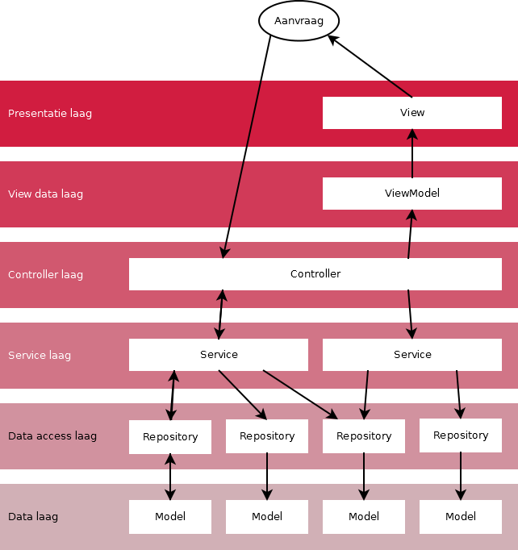

#Technisch Ontwerp

#Inleiding
Dit verslag bevat het Technisch Ontwerp voor SOPROJ6 van 42IN06SOf. Hierin staat een beschrijving over de gekozen architectuur en de gekozen technologie. Daarnaast bevat het een overzicht over welke delen software welke requirements dekken en een beschrijving over de organisatie. Het Technisch Ontwerp bevat ook de prototypes en de uitleg over hoe de gebruiker kan navigeren door de site.

#Context
Het systeem dat we willen gaan bouwen is een systeem waarmee studenten elkaar op diverse aspecten kunnen beoordelen. Een deel van deze aspecten heeft te maken met communicatieve en sociale vaardigheden. De studenten beoordelen elkaar op bepaalde momenten tijdens een project. Daarnaast kan een tutor het systeem gebruiken om zijn studenten tijdens een project te volgen en aan het eind van het project de studenten te beoordelen. Ook een mentor kan het systeem gebruiken. Met het systeem kan de voortgang van een student gevolgd worden.

#Document geschiedenis
|Versie|Datum|Wijzigingen|Reden|Door|
|:-----|:----|:----------|:----|:---|
|0.1|11-11-2013|Eerste versie; bestand aangemaakt.|N.v.t.|Edwin Hattink|
|1.0|26-11-2013|Informatie aangevuld en eerste versie gewijzigd.|N.v.t.|Groep|
|1.1|2-12-2013|Inleiding en context toegevoegd|Feedback gekregen|Jip Verhoeven|
|1.2|2-12-2013|Continuous Integration uitgebreid|Te kort|Patrick Berenschot|

# Architectuur
## MVC
Aangezien er al een constraint is welke afdwingt dat Asp.net MVC 4 gebruikt wordt is de globale architectuur die gebruikt wordt het Model-View-Controller pattern.
Asp.net MVC bied al een basis voor het MVC pattern waarop wordt uitgebreidt.

Om code zo overzichtelijk mogelijk te houden dient er niet veel van het MVC pattern te worden afgeweken.
In veel MVC uitwerkingen ligt veel business logic in de models. Om de data opslag, data manipulatie en de data voor de views allemaal in de models te houden maakt de models onnodig dik.[1] Vaak gebeurt het dan dat de data manipulatie en de view data in de controller worden gestopt. Maar ook dit is sub optimaal.

De meeste MVC uitwerkingen:

* Models: Dik, veel logica
* Controllers: Dun, weinig logica
* Views: Dom, weinig tot geen logica, alleen presentatie

> I make sure my controller is merely the coach, in that it is neither the play (services) or the player (entity model or view model), but simply decides who plays what position and what play to make. [2] 

Indien een applicatie veel logica kent wil dat nog wel eens uit lekken naar de controllers.

Met als gevolg:

* Models: Dik, veel logica
* Controllers: Dik, veel logica
* Views: Dom, weinig (tot geen logica), alleen presentatie

Dit is een ongewenste situatie.

##Union Architecture
Daarom is er gekozen voor de volgende architectuur ook wel bekent als Union Architecture[3]

1. Data laag; Models met database gegevens
2. Data access laag; Repositories met Models (Data logic)
3. Service laag; Model manipulatie (Business logic)
4. Controllers Laag: Aansturing van service laag.
5. View Data laag; ViewModels, data voor gebruik in views
6. Presentatie laag; Views

Hieronder is een diagram met een weergave hoe een request binnen komt en in welke volgorde de verschillende lagen hiermee omgaan. Elke pijl staat voor communicatie met een andere laag. Indien er een dubbele pijl staat dan doet de betreffende laag weer iets terug geven aan de laag welke de methode aanriep.

Hierin wordt duidelijk dat Services aan meerdere Repositories kunnen werken. Dit kan een enkele Repository over meerdere Services zijn. Tevens hoeft er niet altijd een resultaat te zijn van een actie. Zo kan het bevoorbeeld zijn dat er alleen iets geupdate wordt in de models. Hier komt geen feedback voor terug. Indien een Service de status van de update wilt weten dan zou deze dat zelf moeten controleren.

De union architecture nogal gefocused op interfaces. Door het gebruik van interfaces onstaat er een losse koppeling tussen de lagen en zijn de onderdelen makkelijke te veranderen of te vervangen zonder een groot gedeelte van de code te hoeven veranderen.[4] De classes in de lagen hebben dus geen of weinig dependecies op de andere lagen. Een uitzondering hierop is de View data laag en de Presentatie laag aangezien een ViewModel geschreven wordt voor een specifice view en dus een harde koppeling heeft.

## Design Patterns
Om de data laag en de service laag te koppelen wordt er gebruik gemaakt het Repository Pattern.

#Traceability

Al onze requirements afgedekt door de door ons 11 vastgelegde PUC’s. De mensen die de prototypes maken, deze lopen evenredig met de PUC’s, zijn verantwoordelijk voor de bijbehorende requirements. 

Hier onder staat het overzicht:

| PUC nr.       | PUC naam      | Requirements  |
| -------------:|:------------- | :-----|
| 1      | Medestudent beoordelen | 1.1.1  1.2.1  1.2.2  1.3.1  1.3.2  1.4.1  1.5.1  1.5.2  1.6.1  1.6.2  1.1.2  1.1.3  1.2.3  1.2.4 1.2.5  1.2.6  1.2.7  1.2.8  1.3.3  1.4.2  1.4.3  1.5.3  1.5.4  1.5.5 |
| 2      | Groeps indeling aanmaken      |   2.1.1  2.2.1  2.3.1  2.3.2  2.5.1  2.6.1  2.6.2   2.6.3  2.7.1  2.7.2  2.1.2  2.2.2  2.2.3  2.3.3  2.4.1  2.5.2  2.6.4 |
| 4 | Student eigen resultaat inzien      |    6.1.1  6.1.2  6.1.3  6.1.4  6.2.1  6.2.2  6.3.1  6.3.2  6.4.1  |
| 5 | Tutor groepen beoordeling inzien | 5.1.1  5.1.2  5.1.3  5.2.1  5.3.1  5.4.1  5.5.1  5.5.2  5.6.1  5.5.4  |
| 6 | Student cijfer toekennen | 6.1.1  6.1.2  6.1.3  6.1.4  6.2.1  6.2.2  6.3.1  6.3.2  6.4.1 |
| 7 | Student non-actief zetten | 7.1.1  7.2.1  7.2.2  7.3.1  7.3.2  7.4.1  7.5.1  7.6.1  7.6.2  7.6.3  7.7.1  7.7.2  7.7.3  7.1.2  7.1.3  7.2.3  7.5.2  7.6.4 |
| 8 | Een project aanmaken | 8.0.1  8.0.2  8.0.3  8.0.4  8.1.1  8.1.2  8.1.3  8.1.4  8.1.5  8.1.6  8.2.1  8.2.2  8.2.3  8.2.4  8.2.5  8.2.6  8.2.7 |
| 10 | Onderbouwing aanvragen | 10.1.1  10.2.1  10.3.1  10.4.1 |
| 11 | Ter beschikking stellen tutor toewijzing | 11.1.1  11.1.2  11.2.1  11.3.1  11.3.2  11.3.3  11.4.1  11.5.1  11.5.2  11.6.1  11.7.1  11.7.2 |
| 12 | Groepen toewijzen aan project | 12.1.1  12.1.2  12.1.3  12.2.1  12.3.1  12.3.2  12.4.1  12.4.2  12.4.3  12.5.1  12.5.2  12.1.4  12.1.5  12.1.6  12.2.2  12.3.3  12.4.4  12.4.5 |
| 13 | Mentor vooruitgang student inzien | 13.1.1  13.2.1  13.2.2  13.3.1  13.4.1  13.4.2  13.5.1  13.1.2  13.2.3  13.4.3 |

#Technologie
## Framework
###Object Relation Mapper
Er zijn een aantal constraints waarmee de ORM over weg moet kunnen. Zo moet de ORM MSSQL spreken aangezien het gebruik van MSSQL is verplicht.

Eisen:

* Relatief simpel aangezien veel groepsleden onbekent zijn met C# en ORM's
* Veel informatie op het internet voor
* Relaties afdwingen in code
* MSSQL spreken

De twee meest voor de hand liggende ORM's zijn dan N-Hibernate en Entity Framework.
Uiteindelijk is er gekozen voor het Entity Framework omdat:

* Het een editor in Visual Studio heeft.
* Je kan zowel eerst code schrijven en daaruit automatisch een database genereren als anders om
* Entity framework is ondersteund door Microsoft dus veel ondersteuning en informatie
* Het Entity framework implenteerd al gedeeltelijk het Unit of Work en het Repository Pattern.

##Source control
###Git

Om met elkaar samen aan het systeem te kunnen werken hebben wij voor Git gekozen als source control oplossing. We hebben hiervoor gekozen omdat iedereen al een keer heeft gewerkt met Git in eerdere projecten en iedereen dus al de nodige ervaring heeft om meteen met Git aan de slag te kunnen met het project.

###Git-flow

Om te voorkomen dat we conflicten krijgen als we tegelijkertijd aan het werk zijn gebruiken we een speciale manier van het omgaan met de bestanden in de repository. Deze oplossing genaamd 'Git-flow' [5] houdt in dat we gebruik maken van verschillende branches. Elk onderdeel van het systeem heeft een apparte branch. Deze onderdelen noemen we features. Als je aan een nieuwe feature begint maak je vanuit de developer branch een nieuwe sub-tak genaamd feature/myfeature, met als myfeature het onderdeel waar je aan gaat werken. Is de feature klaar dan wordt deze toegevoegd aan de developers branch. Hier wordt alles een geheel en dat geheel wordt aan de release branch toegevoed waar eventueel nog bugfixes uitgevoerd kunnen worden. De inlever versie van het systeem komt in de master branch. Als we voor de oplevering nog ergens een fout tegen komen wordt deze gefixt in de hotfix branch en de hotfix wordt daarna aan de master en develop branches toegevoegd.

###SourceTree

Om iedereen een gelijke en makkelijk te gebruiken omgeving te geven voor het gebruik van Git-flow gebruiken we het programma SourceTree. Dit is een Git gui die Git-flow ondersteund. We hebben hier ook voor gekozen omdat SourceTree meerdere platformen ondersteund.

##Coding guidelines

Om de code overzichtelijk en eenduidig te houden heeft Patrick een stijlgids gemaakt waarin de stijl en naamgeving wordt uitgelegd die we aan gaan houden. Ook staan hierin regels opgesteld voor het aanmaken van bestanden en mappen om de folderstructuur overzichtelijk te houden. We hebben dan ook allemaal afgesproken onszelf aan de guidelines te houden zodat we het niet af hoeven te dwingen met een programma. Tijdens de code reviews wordt er dan ook op gelet dat de code aan de guidelines voldoet.

#Organisatie
##Code reviewing
Binnen een week na voltooien van delen van de software word het door 2 onafhankelijke groepsgenoten gereviewed en getest op alle requirements waaraan de software moet voldoen. Mocht niet overal aan voldaan zijn of mochten er componenten niet werken dan word dat terug gekoppeld aan de schrijver van de software die vervolgens zijn software verbeterd. Wanneer dat af is word het weer opnieuw gereviewed zoals hierboven word vermeld.

###Continuous Integration
Er is altijd één stabile branch en dat is `master`. De `develop` branch bevat de allerlaatste features en kan dus instabiel zijn. Het uitwerken van merge conflicts op de `develop` branch is de verantwoordelijkheid van de versiebeheerder. Diegene zorgt er voor dat een push naar de `develop` of `master` branch een nieuwe build start. Indien de build faalt dient de versiebeheerder het probleem zichtbaar te maken door een issue op GitHub. De Taakbeheerder zal de taak dan toewijzen aan een persoon. Zodra er gereviewd is en de code is goed gekeurd wordt de code in de master branch gezet.

##Rolverdeling
###Projectleider
####Yannik Hegge
De projectleider zal verantwoordelijk zijn voor het administratieve deel van het project.

De projectleider:
* Moet zorgen dat aan het begin van elke vergadering(dus niet tijdens) de urenregistratie van de groepsleden is bijgewerkt.
* Is verantwoordelijk voor de organisatie van google drive(duidelijkheid mapstructuur, bestandsbenamingen).
* Zal vergaderingen voorbereiden en leiden.
* Zal wanneer nodig een aanspreekpunt zijn voor docenten namens de projectgroep.
* Zal de vergadering plannen en aankondigen.

###Notulist
####Robin Collard
De notulist is simpelweg verantwoordelijk voor de notules.

De notulist:
* Moet tijdens elke projectbijeenkomst zorgen dat er een complete, correcte notule wordt gemaakt, en beschikbaar is op google drive.
* Zal bij reviewsessies aantekeningen maken over feedback, en zal deze beschikbaar maken op google drive.

###Agendabeheerder
####Jip Verhoeven
De agendabeheerder is verantwoordelijk voor de algemene planning van het blok.

De agendabeheerder:
* Houdt bij wanneer deadlines zijn.
* Houdt de voortgang van de projectgroep richting de volgende deadline bij.
* Zorgt dat er een algemene planning is gemaakt van de opdrachten in het blok.
* Zorgt dat de taakbeheerder op tijd taken verdeelt om de volgende deadline te kunnen halen.
* Zorgt dat, waar nodig, de planning bijgesteld wordt.
* Zorgt dat producten voor de deadlines ingeleverd worden.
* Zorgt dat deadlines in de Google Agenda komen te staan.

###Taakbeheerder
####Michael vd Ven
De taakbeheerder is verantwoordelijk voor de verdeling van de taken nodig om producten op tijd af te kunnen leveren.

De taakbeheerder:
* Zal samen met de agendabeheerder een zicht houden op wanneer welke producten afgeleverd moeten worden.
* Zorgt dat er taakverdelingen gemaakt worden om producten op tijd af te kunnen leveren.
* Zorgt dat de taakverdeling in de taakverdelingsspreadsheet komt te staan.
* Zorgt dat groepsleden hun taken correct en compleet uitvoeren.
* Zorgt dat, wanneer nodig, taken opnieuw verdeeld worden om verbeterd te kunnen worden.
* Zorgt dat al het gemaakte werk gereviewed wordt(door minstens twee groepsleden die het werk niet zelf hebben gemaakt).

###Versiebeheerder
####Patrick Berenschot
De versiebeheerder zorgt voor het goed gebruik van Git.

De versiebeheerder:
* Zorgt dat alle groepsleden begrijpen hoe Git werkt.
* Zorgt dat er ten alle tijden een huidige versie van het project beschikbaar is om aan te werken.
* Zorgt dat de Git repository goed georganiseerd en werkend blijft.

#Verwijzingen
1. Cairns, Jon. "“Fat model, skinny controller” is a load of rubbish." *Jon Cairns*. N.p., 11 Apr. 2013. Web. 19 Nov. 2013. http://joncairns.com/2013/04/fat-model-skinny-controller-is-a-load-of-rubbish/.

2. "Fat model / thin controller vs. Service layer [closed]." *Stack Overflow*. Version rev 2013.12.2.1186. stack exchange inc, 12 Jan. 2012. Web. 19 Nov. 2013. http://stackoverflow.com/a/8828946.

3. Araujo, Tiago. "Do you know the layers of the onion architecture?." *SSW*. Version 15.28.18.20783. N.p., 11 Sept. 2013. Web. 20 Nov. 2013. http://rules.ssw.com.au/SoftwareDevelopment/RulesToBetterMVC/Pages/The-layers-of-the-onion-architecture.aspx.

4. Walther, Stephen. "Validating with a Service Layer (C#)." *The Official Microsoft ASP.NET Site*. Microsoft, 2 Mar. 2009. Web. 20 Nov. 2013. http://www.asp.net/mvc/tutorials/older-versions/models-(data)/validating-with-a-service-layer-cs.

5. Driessen, Vincent. "A successful Git branching model." *nvie.com*. N.p., 5 Jan. 2010. Web. 18 Nov. 2013. http://nvie.com/posts/a-successful-git-branching-model/.
